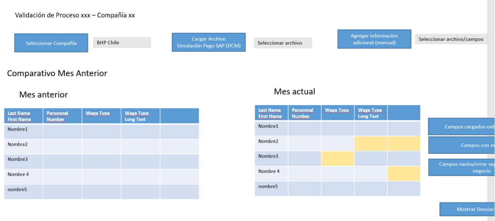
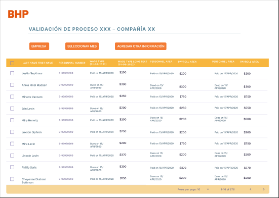
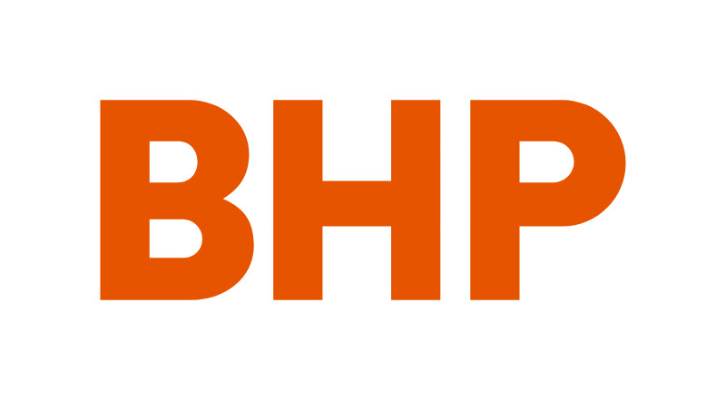
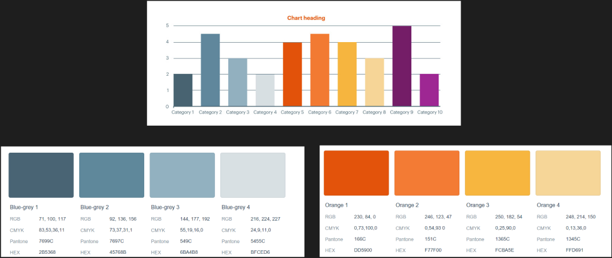
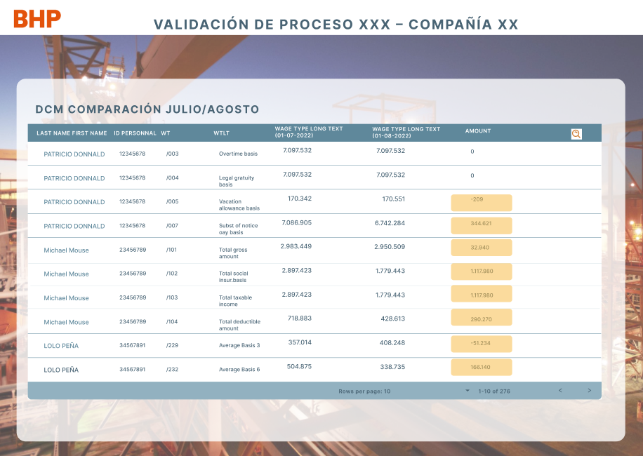

# Reto BHP,
# HR Payroll/Talent Fest 2022 @Laboratoria #
# Deploy link: https://classy-kitsune-0460aa.netlify.app #

## Resumen

  **BHP** tiene en Chile 4 compañías con múltiples reglas de pago, que pasan por validaciones y procesos que requieren análisis minuciosos y exhaustivos.
  
Para esto, se requiere la descarga de varios archivos: el principal es un reporte con la simulación del proceso de pago del mes - "Tabla-DCM", el reporte de activos, reporte de ausentismo entre otros. 
Esta información se consolidad en un único Excel y se genera una base, sobre la cual, se realiza el análisis de los datos y se identifican errores o desviaciones. 

***

## Presentación 
Experiencia usuario.

### Principales usuarios

* Este proyecto esta enfocado hacia el departamento de R.R.H.H, específicamente para el área de pago de nómina. 

### Objetivos de estos usuarios en relación con el producto

* Se espera que la interfaz cuente con: 

* Funcionalidad/opción para la carga de un archivo (desde un link o subiendo un archivo desde un computador).
* Filtro/opción para ordenar la información.
* Mensajes interactivos con el usuario, sobre el resultado de la carga.

### Diseño de Interfaz

* La parte visual forma parte importante,  al igual que la información para que el usuario pueda acceder a los datos de nómina de cada empleado de forma expedita. 
* La interfaz debe estar dirigida para el área de recursos humanos, la cual pueda utilizarse de forma instintiva a la hora de buscar datos.

### Tiempos de uso

* La aplicación se usaría en jornadas laborales de trabajo/oficina. El usuario principalmente lo emplearía para efectuar el pago de nómina de los empleados todos los meses.

### Prototipo de baja

* En reunión con el equipo BHP, se obtuvo información base para el diseño del primer prototipo.

## Diseño

### Imagen de referencia

* Se uso como referencia el prototipo de baja entregado por el equipo de BHP, y se creó un nuevo prototipo integrando el branding proporcionado, junto con otras funcionalidades.

### Logo 

### Paleta de colores

### Prototipo de alta

* Ya en conocimiento del branding utilizado por la empresa mediante reuniones diarias, se diseño una interfaz con los requerimientos solicitados por el equipo de BHP.

### Funcionalidad de la App

La aplicación permite a través de una interfaz intuitiva la carga de un archivo tipo Excel, bien sea ubicado a nivel local o a través de una URL, en donde una vez cargado permite una rápida visualización general de la "Tabla-DCM",  mostrando la comparación entre las columnas **Past** y **Current** destacando en colores los siguientes resultados:

-	En Color Amarillo: celdas con saldos negativos.
-	En Color Verde: celdas con saldo a favor.
-	En Color Azul: celdas en donde los valores se mantienen iguales. 
-	En Color Blanco: celdas con datos faltantes.

De igual forma se muestra la **Cantidad del Total de Discrepancias** y el porcentaje que éstas representan del total general. 
Otra funcionalidad a destacar es la del buscador, en donde se pueden seleccionar y filtrar datos de manera específica a medida que se va escribiendo el nombre del ítem deseado.

* Como ítem 2 se deja integrado en la parte inferior un botón de descarga para archivos de los resultados obtenidos.

### Bondades de la App BHP HR Payroll

Dentro de los méritos de esta app tenemos:

-	Interfaz Intuitiva: manteniendo el branding y colores empresariales. 
-	Mayor Velocidad de Carga: Reducción del tiempo de carga del archivo.
-	Mayor Eficiencia: Visualización de manera clara y rápida de discrepancias y otros ítems de interés.
-	Optimización del Tiempo de Trabajo: al obtener resultados eficientes y confiables.
-	Escalable: sirviendo como base para el crecimiento a futuro de la app.

Mediante este [link](https://www.figma.com/file/P5MMMTQwwWGTxz5diq1QIV/BHP---Talent-Fest?node-id=0%3A1) se puede acceder a los prototipos hechos en Figma representado UX/UI antes de que empezará el codeo.

**Link de descarga de Tabla excel para prueba**
[link](https://docs.google.com/spreadsheets/d/1-riVF1YI5drFRqDoCoeS2jL0q5b6sHfs/edit?usp=sharing&ouid=106150383958074611680&rtpof=true&sd=true)

**Cohort SCL020 Laboratoria Front-End**

**Equipo desarrollador:**
- Constanza Vargas.
- Ianka Ferrada.
- Marta Hung.
- Carolina Colmenares.
- Soledad Cortés.

**Mentora:**

- Fernanda Albuquerque.

**Coach honorifico**

-  Mauricio Santelices.

